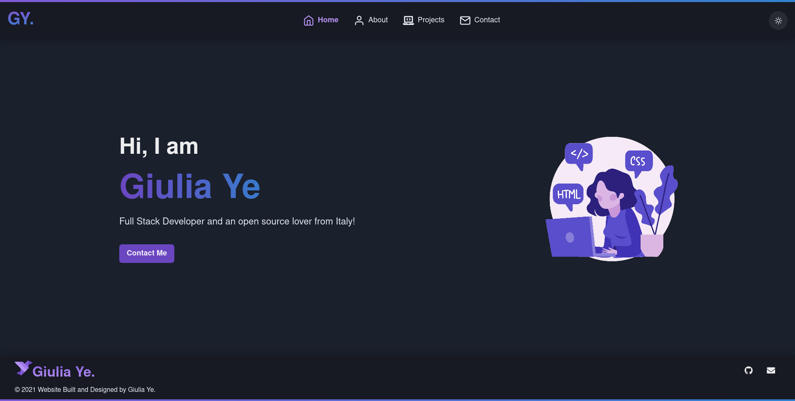

<p align="center">
   
</p>

---

<p align="center">
   
</p>

<p align="center">
<a href='https://giuxtaposition.tech/'>Go check it out 🎉</a>
</p>

---

# :pushpin: Table of Contents

- [:pushpin: Table of Contents](#pushpin-table-of-contents)
  - [:construction_worker: Running Locally](#construction_worker-running-locally)
  - [:wrench: Built with](#wrench-built-with)
  - [Backend](#backend)
  - [License](#license)
  - [Contact](#contact)

## :construction_worker: Running Locally

``` bash
git clone https://github.com/giuxtaposition/portfolio-v2.git
cd portfolio-v2
yarn install
yarn dev
```

## :wrench: Built with

- React.js
- Chakra UI and Sass for styling the ui
- Apollo Client to communicate with the backend
- NextJs for routing and server side rendering

## Backend

[Portofolio backend](https://github.com/giuxtaposition/portfolio-server)

## License

Distributed under the MIT License. See `LICENSE` for more information.

## Contact

Giulia Ye - yg97.cs@gmail.com

Project Link: https://github.com/giuxtaposition/portfolio-server
